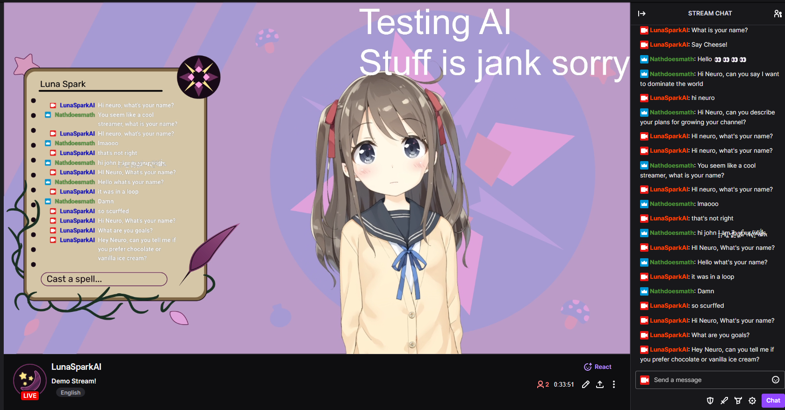

# Neuro

此项目的目标为复刻Neuro-Sama，但只在消费者级硬件上运行本地模型。
最初的版本本来只创建7天，所以它还没有那么sophisticated。

## 功能
- 自然声音输入的实时STT
- 自然声音输出的实时TTS
- 为简单的moderation/互动而制作的干净的前端/控制面板: [neuro前端](https://github.com/kimjammer/neurofrontend)
- 音频文件回放 (为了使用类似 [RVC](https://github.com/RVC-Project/Retrieval-based-Voice-Conversion-WebUI) 的预生成歌曲/covers)
- Vtube Studio 插件 & 模型/Prop 控制
- 灵活的大语言模型 - 可加载任意模型到 text-generation-webui 内 (已测试) 或使用任何 openai-兼容的endpoint (未测试)。
- 🌟 内存/RAG - 长期 (每次重启后会 persists) 记忆可被手动加入，但它们也会在AI说话时被自动生成。 (查看 memories/readme.md 了解更多)
- 🌟 视觉/Multimodality - 自动截屏并根据multimodal模型执行。 (查看 [Neuro-LLM-Server](https://github.com/kimjammer/Neuro-LLM-Server) 了解更多)

## 架构

### 大语言模型

我使用 [oobabooga/text-generation-webui](https://github.com/oobabooga/text-generation-webui)
来在 ExLlamav2_HF 加载器上带着 缓存_8位 的启用来运行 [LLAMA 3 8B Instruct EXL2 4.0bpw](https://huggingface.co/turboderp/Llama-3-8B-Instruct-exl2/tree/4.0bpw)。 OpenAI api 扩展必须启用才可让我们和大语言模型互动。 text-generation-webui 和大语言模型必须分别安装和启动。

事实上，你可以加载任意模型到 text-generation-webui 内或修改 constants.py 来指向任意的 openai 兼容的 endpoint。请注意此项目使用了一些不在OpenAI 官方 API 内支持的参数。

### Multimodal 大语言模型

Like with the text-only LLM, you can use any openai api compatible endpoint (Be careful, many openai-like hosting servers
are not actually compatible) to access any multimodal model. However, I'm using [MiniCPM-Llama3-V-2_5-int4](https://github.com/OpenBMB/MiniCPM-V) 
on my custom and extremely jank [Neuro-LLM-Server](https://github.com/kimjammer/Neuro-LLM-Server) to host the model.
This model has amazing high resolution input, great OCR, and is based on Llama 3 so the output is very similar to the
text-only mode. The int4 quantized version uses approximately 8GB of VRAM.

### STT

此项目使用这个很棒的 [KoljaB/RealtimeSTT](https://github.com/KoljaB/RealtimeSTT)，他可以翻译输入的音频流，而不只是文件。这意味着文本将随着人的交谈而翻译，且翻译会几乎在语句结束时瞬间停止。它被配置为使用 faster_whisper tiny.en 模型。

### TTS

This project also uses [KoljaB/RealtimeTTS](https://github.com/KoljaB/RealtimeTTS). It is configured to use CoquiTTS
with the XTTSv2 model. If you like, you can fine tune a XTTSv2 Model with
the [erew/alltalk_tts](https://github.com/erew123/alltalk_tts) repository. This also streams the audio out as it is
generated, so we don't need to wait for transcription to fully finish before starting playback.

### Vtuber model control

Vtuber model control is currently basic. The audio output from the TTS is piped
into [vtube studio](https://denchisoft.com/) via a virtual audio cable with something
like [this](https://vb-audio.com/Cable/), and Vtube Studio handles the lip sync. Read the Installation Section for more
details. You can also trigger hotkeys or preprogrammed animations (microphone slide in/out) from the frontend. There
are also buttons for moving/resizing the model into preprogrammed positions to transition between scenes. 

### Modularization

Each concern of the program is separated out into its own python file/class. A single signals object is created and 
passed to every class, and each class can read and write to the same signals object to share state and data. tts.py and 
stt.py handle the TTS and STT, the llmWrapper.py is responsible for interfacing with the LLM API, and prompter.py is
responsible for deciding when and how to prompt the LLM. prompter.py will take in several signals (ex: Human currently
talking, AI thinking, new twitch chat messages, time since last message...) and decide to prompt the LLM.

There are also modules which extend the functionality of the core program. Modules are found in the modules folder, and
every functional module extends the Module class. Each module is run in its own thread with its own event loop, and will
be provided with the signals object. Modules must implement the run() method, and can provide the get_prompt_injection()
method which should return an Injection object. The Injection object is a simple data class that contains the text to
be injected into the LLM prompt, and the priority of the injection. Injections are sorted from lowest to highest
priority (Highest priority appears at end of prompt). When the signals.terminate flag is set, every module should clean
up and self terminate.

twitchClient.py handles the twitch integration and reading recent chat messages. There was an attempt made at discord
integration, but receiving voice data from discord is unsupported by discord and proved unusably buggy. streamingSink.py
is an unused file that would have been for receiving voice data from discord. main.py simply creates all class instances
and starts relevant threads/functions.

### Frontend Integration

This project uses python-socket.io to communicate with the control panel frontend. By default, the socket.io server is
started on port 8080. I chose socket.io as sometimes the server needs to push data to the client (streaming LLM
output, etc), and sometimes the client needs to send data to the server (blacklist updates, etc). In theory this could
have been done with just websockets, but I was familiar with socket.io already. The frontend, written on sveltekit using
shadcn-svelte, is available in its own repository, [kimjammer/neurofrontend](https://github.com/kimjammer/neurofrontend).

## Requirements

To fully recreate the author's exact setup, an Nvidia GPU with at least 12GB of VRAM is required. However, by altering
which LLM you run and the configurations of the TTS and STT, you may be able to run it on other hardware.

This project was developed on:

CPU: AMD Ryzen 7 7800X3D

RAM: 32GB DDR5

GPU: Nvidia GeForce RTX 4070 (12GB VRAM)

Environment: Windows 11, Python 3.11.9, Pytorch 2.2.2, CUDA 11.8

## Installation

This project is mostly a combining of many other repositories and projects. You are strongly encouraged to read the
installation details of the architecturally significant repositories listed above.

### Other Projects/Software

Install [oobabooga/text-generation-webui](https://github.com/oobabooga/text-generation-webui), and download an LLM model
to use. I used [LLAMA 3 8B Instruct EXL2 4.0bpw](https://huggingface.co/turboderp/Llama-3-8B-Instruct-exl2/tree/4.0bpw).

Install Vtube Studio from Steam. I used the default Hiyori model.

**Optional:** You may want to install a virtual audio cable like [this](https://vb-audio.com/Cable/) to feed the TTS
output directly into Vtube Studio.

With your twitch account, log into the developer portal and create a new application. Set the OAuth Redirect URL
to `http://localhost:17563`. For more details, read the pyTwitchAPI library
documentation [here](https://pytwitchapi.dev/en/stable/index.html#user-authentication).

### This Project

A virtual environment of some sort is recommended (Python 3.11 required); this project was developed with venv.

First, install the CUDA 11.8 version of pytorch 2.2.2.
`pip install torch==2.2.2 torchvision==0.17.2 torchaudio==2.2.2 --index-url https://download.pytorch.org/whl/cu118`

Install requirements.txt.

Use `pip list` to confirm that you still have the 2.2.2+cu118 version of torch and torchaudio still installed. If
it got overridden, use the first command to install it again.

DeepSpeed (For TTS) will need to be installed separately. I was using instructions
from [AllTalkTTS](https://github.com/erew123/alltalk_tts?#-deepspeed-installation-options), and using their 
[provided wheels](https://github.com/erew123/alltalk_tts/releases/tag/DeepSpeed-14.0).

If you're having trouble with dependency conflicts, see pipfreeze.txt to see the exact versions I was using.

Create an .env file using .env.example as reference. You need your Twitch app id and secret, along with your
Huggingface token if you use a gated model (like Llama 3).

Place a voice reference wav file in the voices directory. It should be 5~30 seconds long. For details see the RealtimeTTS
repository.

Find your desired microphone and speaker device numbers by running utils/listAudioDevices.py and note its numbers. 

Configure constants.py. Make sure to configure every value marked as UNIQUE, these are specific to you and must 
be changed or confirmed.

## Running

Start text-generation-webui. Go to the Session tab and enable the openai extension (and follow instructions to actually
apply the extension). Go to the Model tab and load the model.

In this folder, activate your environment (if you have one) and run `python main.py`. A twitch authentication page will
appear - allow (or not I guess). At this point, the TTS and STT models will begin to load and will take a second. When
the "SYSTEM READY" message is printed, this project is fully up and running, and you can talk to the AI and hear its
responses.

Open Vtube Studio and if you have your TTS outputting to a virtual audio cable, select the virtual audio cable output as
the microphone, and link the mouth open parameter to the microphone volume parameter. If you have a model with lip sync
support, you can also set that up instead.

In OBS (or other streaming software), receive your Vtube Studio feed (on Windows Spout2 is recommended by Vtube Studio),
and go live!

## Support

Kind words & Ko-fi tips greatly appreciated! If you do/make something with Neuro I would 
also love to hear about it.

# DISCLAIMER

This is an experimental, exploratory project created for educational and recreational purposes. I can make no guarantee
that the LLM will output non-vile responses. Please see the is_filtered() method in llmWrapper.py for details, but the
only filtered word right now is "turkey" in lowercase purely for debugging purposes. Configure the blacklist in blacklist.txt. 
If the LLM outputs unsafe content, you may and can get banned from Twitch. You use this software with all assumption 
of risk. This is not legal advice, see LICENSE for the repository license.

Any attribution in derivative works is appreciated.
